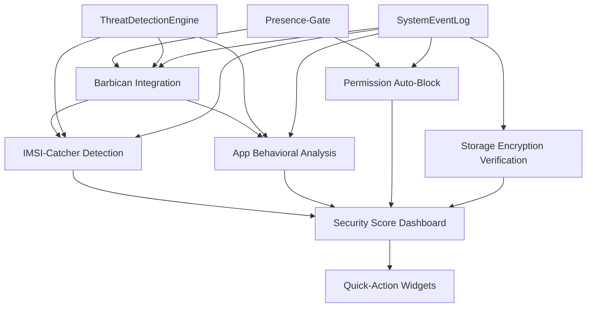

# Umsetzungsplan: 7 Sicherheitsfeatures für Warden

**Version:** 1.0  
**Datum:** 2026-08-29  
**Status:** Freigegeben für Phase 0  
**Verantwortlich:** Mistral Vibe (Planung)  

---

## 📌 Zusammenfassung

Dieses Dokument beschreibt die **vollständige Umsetzung von 7 Sicherheitsfeatures** für die Warden-App:

1. **Barbican Netzwerk-Sperre Integration**
2. **IMSI-Catcher Detection**
3. **App Behavioral Analysis** (Bedrohungserkennung)
4. **Permission Auto-Block**
5. **Storage Encryption Verification**
6. **Security Score Dashboard**
7. **Quick-Action Widgets**

**Gesamtaufwand:** 14-16 Wochen (6 Phasen)  
**Design-Constraints:** Siehe [CLAUDE.md](../CLAUDE.md) (domain/*, Fail-safe, Presence-Gate, Offline-first)  
**Architektur-Prinzipien:** Siehe [architektur-review-2026-08.md](./architektur-review-2026-08.md)

---

## 🎯 Features im Überblick

| # | Feature | Priorität | Phase | Aufwand | Status |
|---|---------|-----------|-------|---------|--------|
| 1 | Barbican Netzwerk-Sperre Integration | ⭐⭐⭐⭐⭐ | 1 | 3 Wochen | ⏳ Geplant |
| 2 | IMSI-Catcher Detection | ⭐⭐⭐⭐ | 2 | 3 Wochen | ⏳ Geplant |
| 3 | Permission Auto-Block | ⭐⭐⭐ | 2 | 3 Wochen | ⏳ Geplant |
| 4 | Storage Encryption Verification | ⭐⭐⭐ | 2 | 3 Wochen | ⏳ Geplant |
| 5 | Security Score Dashboard | ⭐⭐ | 3 | 3 Wochen | ⏳ Geplant |
| 6 | Quick-Action Widgets | ⭐⭐ | 3 | 3 Wochen | ⏳ Geplant |
| 7 | App Behavioral Analysis | ⭐⭐⭐⭐ | **VERSCHOBEN** | 3 Wochen | ⏸️ Verschoben |

**Hinweis:** App Behavioral Analysis (Feature 7) wurde aus der initialen Planung genommen und wird nach Barbican-Integration umgesetzt.

---

## 📅 Phasenplan (11-13 Wochen, ohne Feature 3)

### Phase 0: Vorbereitung (1 Woche)
**Ziel:** Grundlagen legen für alle folgenden Phasen.

| Aufgabe | Verantwortlich | Dauer | Status |
|---------|----------------|-------|--------|
| [x] Design-Dokumente für alle Features erstellen | Entwickler | 2 Tage | ✅ |
| [x] Barbican-Code analysieren (`app/netlock-disabled/`) | Entwickler | 2 Tage | ✅ |
| [x] Kernfehler in Barbican identifizieren und dokumentieren | Entwickler | 1 Tag | ✅ |
| [ ] Barbican-Hypothesen testen und Kernfehler beheben | Entwickler | 3 Tage | ⏳ |
| [ ] Barbican-Code reaktivieren (Dateien verschieben, Verweise wiederherstellen) | Entwickler | 1 Tag | ⏳ |
| [ ] Projektstruktur für domain-Layer vorbereiten | Entwickler | 1 Tag | ⏳ |

**Meilenstein:** Barbican-Kernfehler behoben, Code reaktiviert, Design-Dokumente fertig.

---

### Phase 1: Barbican Integration (3 Wochen)
**Ziel:** Netzwerk-Sperre als Foundation für andere Features reaktivieren.

| Aufgabe | Verantwortlich | Dauer | Abhängigkeiten |
|---------|----------------|-------|----------------|
| [ ] Barbican-Kerncode aus `app/netlock-disabled/` migrieren | Entwickler | 3 Tage | Phase 0 |
| [ ] `NetLockService.kt` (domain-Layer) implementieren | Entwickler | 5 Tage | Phase 0 |
| [ ] Presence-Gate-Integration (`PresenceDetector.kt`) | Entwickler | 2 Tage | Phase 0 |
| [ ] Fail-safe-Mechanismus (lokaler Modus bei Server-Ausfall) | Entwickler | 3 Tage | Phase 0 |
| [ ] API-Anbindung an Barbican-Server | Entwickler | 2 Tage | Phase 0 |
| [ ] Unit-Tests für NetLockService | Entwickler | 2 Tage | - |
| [ ] Integrationstests mit ThreatDetectionEngine | Entwickler | 3 Tage | - |

**Meilenstein:** Barbican-Sperre funktioniert zuverlässig, Fail-safe getestet, Integration in ThreatDetectionEngine.

---

### Phase 2: Bedrohungserkennung + Permission & Storage (3 Wochen)
**Ziel:** IMSI-Catcher Detection + Permission Auto-Block + Storage Encryption Verification.

#### 2.1 IMSI-Catcher Detection (1 Woche)
| Aufgabe | Verantwortlich | Dauer | Abhängigkeiten |
|---------|----------------|-------|----------------|
| [ ] `ImsiCatcherDetector.kt` (domain-Layer) erstellen | Entwickler | 3 Tage | Phase 0 |
| [ ] Signalstärke-Analyse implementieren | Entwickler | 2 Tage | - |
| [ ] Zell-ID-Wechsel-Überwachung | Entwickler | 2 Tage | - |

#### 2.2 Permission Auto-Block (1 Woche)
| Aufgabe | Verantwortlich | Dauer | Abhängigkeiten |
|---------|----------------|-------|----------------|
| [ ] `AutoBlockEngine.kt` (domain-Layer) erstellen | Entwickler | 3 Tage | Phase 0 |
| [ ] Dynamische Regel-Engine (JSON-konfigurierbar) | Entwickler | 3 Tage | - |
| [ ] 3-Sufen-System (Warnung, Temporär, Permanent) | Entwickler | 2 Tage | - |
| [ ] Presence-Gate-Integration | Entwickler | 2 Tage | - |

#### 2.3 Storage Encryption Verification (1 Woche)
| Aufgabe | Verantwortlich | Dauer | Abhängigkeiten |
|---------|----------------|-------|----------------|
| [ ] `EncryptionVerifier.kt` (domain-Layer) erstellen | Entwickler | 2 Tage | Phase 0 |
| [ ] FDE, FBE, KeyStore-Prüfung | Entwickler | 3 Tage | - |
| [ ] 1-Klick-Verschlüsselungs-Aufforderung | Entwickler | 2 Tage | - |

**Meilenstein:** Alle drei Module funktionieren, Integration mit Barbican getestet.

---

### Phase 3: UI/UX (3 Wochen)
| Aufgabe | Verantwortlich | Dauer | Abhängigkeiten |
|---------|----------------|-------|----------------|
| [ ] `AutoBlockEngine.kt` (domain-Layer) erstellen | Entwickler | 3 Tage | Phase 0 |
| [ ] Dynamische Regel-Engine (JSON-konfigurierbar) | Entwickler | 3 Tage | - |
| [ ] 3-Sufen-System (Warnung, Temporär, Permanent) | Entwickler | 3 Tage | - |
| [ ] Presence-Gate-Integration (nur bei Abwesenheit sperren) | Entwickler | 2 Tage | - |
| [ ] Whitelist für System-Apps | Entwickler | 1 Tag | - |
| [ ] Benachrichtigungssystem mit "Warum?"-Erklärungen | Entwickler | 2 Tage | - |
| [ ] Unit-Tests | Entwickler | 2 Tage | - |

**Meilenstein:** Alle drei Module funktionieren, Integration mit Barbican getestet.

---

### Phase 3: UI/UX (3 Wochen)
**Ziel:** Security Score Dashboard + Quick-Action Widgets.

#### 3.1 Security Score Dashboard (2 Wochen)
| Aufgabe | Verantwortlich | Dauer | Abhängigkeiten |
|---------|----------------|-------|----------------|
| [ ] `SecurityScoreCalculator.kt` (domain-Layer) erstellen | Entwickler | 3 Tage | Phase 0 |
| [ ] Gewichtungssystem (30% Bedrohung, 25% Permissions, 20% Encryption, 15% Netzwerk, 10% Integrität) | Entwickler | 2 Tage | - |
| [ ] Echtzeit-Update-Mechanismus | Entwickler | 2 Tage | - |
| [ ] UI: Kreis-Diagramm mit Score | Entwickler | 3 Tage | - |
| [ ] UI: Drill-down pro Kategorie | Entwickler | 3 Tage | - |
| [ ] UI: Historischer Verlauf (30 Tage) | Entwickler | 2 Tage | - |
| [ ] Handlungsempfehlungen bei Score <50 | Entwickler | 1 Tag | - |

#### 3.2 Quick-Action Widgets (1 Woche)
| Aufgabe | Verantwortlich | Dauer | Abhängigkeiten |
|---------|----------------|-------|----------------|
| [ ] Widget-Basisstruktur (AppWidgetProvider) | Entwickler | 1 Tag | - |
| [ ] Schnell-Sperre-Widget (1-Tap für alle sensiblen Permissions) | Entwickler | 1 Tag | Phase 2.2 |
| [ ] Netzwerk-Sperre-Widget (Barbican-Trigger) | Entwickler | 1 Tag | Phase 1 |
| [ ] Bedrohungs-Scan-Widget | Entwickler | 1 Tag | Phase 2.1 |
| [ ] Sicherheits-Score-Widget (Mini-Dashboard) | Entwickler | 2 Tage | Phase 3.1 |
| [ ] Fail-safe: Standard-View bei Crash | Entwickler | 1 Tag | - |

**Meilenstein:** Dashboard und Widgets funktionieren, Design konsistent mit Warden-Theme.

---

### Phase 4: Integration & Testing (2 Wochen)
**Ziel:** Alle Komponenten verbinden und End-to-End-Tests durchführen.

| Aufgabe | Verantwortlich | Dauer | Abhängigkeiten |
|---------|----------------|-------|----------------|
| [ ] Integration aller Module in Warden-App | Entwickler | 3 Tage | Phasen 1-4 |
| [ ] End-to-End-Tests für alle Features | Entwickler + QA | 2 Tage | - |
| [ ] Performance-Optimierung | Entwickler | 2 Tage | - |

**Meilenstein:** Dashboard und Widgets funktionieren, Design konsistent mit Warden-Theme.

---

### Phase 4: Integration & Testing (2 Wochen)
**Ziel:** Alle Komponenten verbinden und End-to-End-Tests durchführen.

| Aufgabe | Verantwortlich | Dauer | Abhängigkeiten |
|---------|----------------|-------|----------------|
| [ ] Integration aller Module in Warden-App | Entwickler | 3 Tage | Phasen 1-3 |
| [ ] End-to-End-Tests für alle Features | Entwickler + QA | 2 Tage | - |
| [ ] Performance-Optimierung | Entwickler | 2 Tage | - |
| [ ] App Behavioral Analysis (Feature 7) nachrüsten | Entwickler | 5 Tage | - |

**Meilenstein:** Alle Features integriert, erste End-to-End-Tests erfolgreich.

---

### Phase 5: Final Testing & Polish (2 Wochen)
**Ziel:** Finales Testing, Bugfixing, Dokumentation.

| Aufgabe | Verantwortlich | Dauer | Abhängigkeiten |
|---------|----------------|-------|----------------|
| [ ] Umfassende Unit-Tests für alle neuen Komponenten | Entwickler | 3 Tage | - |
| [ ] Integrationstests | Entwickler | 3 Tage | - |
| [ ] Penetrationstests (extern) | Externer Tester | 5 Tage | - |
| [ ] Bugfixing basierend auf Test-Ergebnissen | Entwickler | 3 Tage | - |
| [ ] Dokumentation aktualisieren | Entwickler | 2 Tage | - |
| [ ] Release-Vorbereitung | Entwickler | 2 Tage | - |

**Meilenstein:** Alle Tests bestanden, Dokumentation komplett, Release-ready.

---

## 🏗️ Technische Architektur

### 1. Barbican Netzwerk-Sperre Integration

#### Komponenten:
- **`NetLockService.kt`** (domain-Layer)
  - Zentrale Logik für Netzwerksperre
  - Interface: `INetLockService`
  - Implementierung: `NetLockServiceImpl`

- **`NetLockRepository.kt`** (domain-Layer)
  - Speichert lokale Regeln und Sperr-Zustände
  - Offline-first: Daten werden lokal cached

- **`BarbicanApiClient.kt`** (app-Layer)
  - Kommunikation mit Barbican-Servern
  - Nur für Sync/Updates, nicht für Kernfunktionen

#### Fail-safe-Mechanismus:
```kotlin
// Pseudocode
class NetLockServiceImpl(private val repository: NetLockRepository) : INetLockService {
    override fun lockNetwork(reason: LockReason): Result<Unit> {
        return try {
            // 1. Versuche Barbican-Server zu erreichen
            val serverResponse = barbicanApi.lock(reason)
            if (serverResponse.isSuccess) {
                repository.saveLockState(reason)
                applyLocalLock() // Android DevicePolicyManager
                Result.success(Unit)
            } else {
                // 2. Fallback: Lokaler Modus
                repository.saveLockState(reason, isLocalFallback = true)
                applyLocalLock()
                Result.success(Unit)
            }
        } catch (e: Exception) {
            // 3. Notfall: Nur lokale Sperre
            repository.saveLockState(reason, isEmergency = true)
            applyLocalLock()
            Result.success(Unit) // Immer Erfolg, selbst im Notfall
        }
    }
}
```

#### Presence-Gate-Integration:
- Netzwerksperre nur aktivieren, wenn:
  - **Automatisch:** Bedrohung erkannt **UND** Benutzer nicht anwesend (Presence-Gate = false)
  - **Manuell:** Benutzer bestätigt Sperre explizit

#### Abhängigkeiten:
- Android `DevicePolicyManager` für Netzwerksperre
- `PresenceDetector.kt` (bereits vorhanden)
- Barbican-Server-API (optional)

---

### 2. IMSI-Catcher Detection

#### Komponenten:
- **`ImsiCatcherDetector.kt`** (domain-Layer)
  - Interface: `IImsiCatcherDetector`
  - Implementierung: `ImsiCatcherDetectorImpl`

- **`SignalMonitor.kt`** (domain-Layer)
  - Überwacht Signalstärke, Zell-ID, LAC/TAC

- **`CellDatabase.kt`** (domain-Layer)
  - Lokale Datenbank mit bekannten Netzwerkzellen
  - Wird periodisch mit Barbican-Servern synchronisiert

#### Detektionslogik:
```kotlin
// Pseudocode
data class ThreatIndicator(
    val signalStrengthJump: Boolean = false,
    val frequentCellChanges: Boolean = false,
    val unknownCellId: Boolean = false,
    val invalidLacTac: Boolean = false
)

class ImsiCatcherDetectorImpl(
    private val signalMonitor: SignalMonitor,
    private val cellDatabase: CellDatabase
) : IImsiCatcherDetector {
    override fun detect(): ThreatLevel {
        val indicators = mutableListOf<ThreatIndicator>()
        
        // 1. Signalstärke-Sprünge
        if (signalMonitor.hasSuddenSignalJump()) {
            indicators.add(ThreatIndicator(signalStrengthJump = true))
        }
        
        // 2. Häufige Zell-Wechsel
        if (signalMonitor.hasFrequentCellChanges()) {
            indicators.add(ThreatIndicator(frequentCellChanges = true))
        }
        
        // 3. Unbekannte Zell-ID
        if (!cellDatabase.isKnownCell(signalMonitor.currentCellId)) {
            indicators.add(ThreatIndicator(unknownCellId = true))
        }
        
        // 4. Ungültiges LAC/TAC
        if (!cellDatabase.isValidLacTac(signalMonitor.currentLacTac)) {
            indicators.add(ThreatIndicator(invalidLacTac = true))
        }
        
        return when {
            indicators.size >= 3 -> ThreatLevel.HIGH
            indicators.size >= 2 -> ThreatLevel.MEDIUM
            indicators.size >= 1 -> ThreatLevel.LOW
            else -> ThreatLevel.NONE
        }
    }
}
```

#### Integration:
- **Automatische Aktion:** Bei `ThreatLevel.HIGH` → Barbican-Sperre auslösen
- **Benachrichtigung:** Bei `ThreatLevel.MEDIUM` oder höher → Push-Benachrichtigung

---

### 3. App Behavioral Analysis

#### Komponenten:
- **`BehaviorMonitor.kt`** (domain-Layer)
  - Überwacht App-Verhalten in Echtzeit

- **`PermissionTracker.kt`** (domain-Layer)
  - Trackt Permission-Nutzung pro App

- **`NetworkTracker.kt`** (domain-Layer)
  - Trackt Netzwerkzugriffe pro App

- **`AnomalyDetector.kt`** (domain-Layer)
  - Lokales ML-Modell für Anomalie-Erkennung

#### ML-Modell (TensorFlow Lite):
- **Eingabe-Features:**
  - Permission-Nutzung (Kamera, Mikrofon, Standort, etc.)
  - Netzwerkzugriffe (IPs, Ports, Datenvolumen)
  - Hintergrundaktivität (CPU, Speicher, Sensoren)
  - Zeitmuster (z. B. Zugriffe um 3 Uhr morgens)

- **Ausgabe:**
  - Anomalie-Score (0.0 - 1.0)
  - Klassifikation (Normal, Verdächtig, Gefährlich)

- **Modell-Training:**
  - Vorab trainiert mit öffentlich verfügbaren Datensätzen
  - Lokales Fine-Tuning basierend auf Benutzer-Verhalten

#### Regelbasierte Ergänzung:
```kotlin
// Pseudocode
val suspiciousRules = listOf(
    Rule(
        condition = { app -> app.hasPermission(Permission.CAMERA) && !app.isCameraApp() },
        action = { app -> flagAsSuspicious(app, "Camera access without justification") }
    ),
    Rule(
        condition = { app -> app.hasBackgroundLocationAccess() && !app.isNavigationApp() },
        action = { app -> flagAsSuspicious(app, "Background location access without justification") }
    ),
    Rule(
        condition = { app -> app.sendsDataToUnknownIps() },
        action = { app -> flagAsDangerous(app, "Data exfiltration detected") }
    )
)
```

---

### 4. Permission Auto-Block

#### Komponenten:
- **`AutoBlockEngine.kt`** (domain-Layer)
  - Zentrale Logik für automatische Sperren

- **`BlockRule.kt`** (domain-Layer)
  - Datenklasse für Sperr-Regeln

- **`BlockAction.kt`** (domain-Layer)
  - Definiert Aktionen (Warnung, Temporär, Permanent)

#### Regel-Engine:
```kotlin
// Pseudocode
data class BlockRule(
    val appPackage: String?, // null = alle Apps
    val permission: Permission,
    val condition: Condition, // z. B. "App nutzt Permission im Hintergrund"
    val action: BlockAction, // WARN, TEMPORARY_BLOCK, PERMANENT_BLOCK
    val severity: Severity // LOW, MEDIUM, HIGH
)

class AutoBlockEngine(
    private val ruleRepository: BlockRuleRepository,
    private val presenceDetector: PresenceDetector
) {
    fun checkAndApply(app: App, permission: Permission, context: Context): BlockAction? {
        val rules = ruleRepository.getRulesFor(app, permission)
        
        for (rule in rules) {
            if (rule.condition.matches(context)) {
                // Nur sperren, wenn Benutzer nicht anwesend ist
                if (presenceDetector.isPresent()) {
                    return null // Keine automatische Sperre
                }
                
                // Loggen und Benachrichtigung senden
                logBlock(app, permission, rule)
                notifyUser(app, permission, rule)
                
                return rule.action
            }
        }
        return null
    }
}
```

#### Beispiel-Regeln:
| App-Typ | Permission | Bedingung | Aktion | Schwere |
|---------|------------|-----------|--------|---------|
| Spiele | SMS | Im Hintergrund | PERMANENT_BLOCK | HIGH |
| Social Media | Hintergrund-Standort | Immer | TEMPORARY_BLOCK | MEDIUM |
| Taschenlampe | Kamera | Im Hintergrund | WARN | LOW |
| Alle | Mikrofon | Im Hintergrund | WARN | MEDIUM |

---

### 5. Storage Encryption Verification

#### Komponenten:
- **`EncryptionVerifier.kt`** (domain-Layer)
  - Prüft Verschlüsselungsstatus

- **`EncryptionStatus.kt`** (domain-Layer)
  - Datenklasse für Verschlüsselungsstatus

#### Prüfungen:
```kotlin
// Pseudocode
data class EncryptionStatus(
    val fullDiskEncryption: EncryptionState, // ENABLED, DISABLED, NOT_SUPPORTED
    val fileBasedEncryption: Map<String, EncryptionState>, // Pro App
    val keyStoreIntegrity: KeyStoreState, // HARDWARE_BACKED, SOFTWARE, COMPROMISED
    val externalStorage: EncryptionState
)

class EncryptionVerifier(
    private val deviceInfo: DeviceInfo,
    private val appManager: AppManager
) {
    fun verify(): EncryptionStatus {
        val fdeState = checkFullDiskEncryption()
        val fbeStates = checkFileBasedEncryption()
        val keyStoreState = checkKeyStoreIntegrity()
        val externalState = checkExternalStorage()
        
        return EncryptionStatus(fdeState, fbeStates, keyStoreState, externalState)
    }
    
    private fun checkFullDiskEncryption(): EncryptionState {
        return if (deviceInfo.isFdeEnabled()) {
            EncryptionState.ENABLED
        } else if (deviceInfo.supportsFde()) {
            EncryptionState.DISABLED
        } else {
            EncryptionState.NOT_SUPPORTED
        }
    }
    
    private fun checkFileBasedEncryption(): Map<String, EncryptionState> {
        val sensitiveApps = listOf("com.banking.app", "org.signal")
        return sensitiveApps.associateWith { appPackage ->
            if (appManager.isFbeEnabled(appPackage)) {
                EncryptionState.ENABLED
            } else {
                EncryptionState.DISABLED
            }
        }
    }
}
```

#### Aktionen bei Lücken:
1. **FDE deaktiviert:**
   - Warnung: "Ihr Gerät ist nicht vollständig verschlüsselt. Daten können bei Diebstahl gelesen werden."
   - Aktion: 1-Klick-Verschlüsselung (nutze `DevicePolicyManager.setStorageEncryption()`)

2. **FBE für sensible Apps deaktiviert:**
   - Warnung: "Banking-App X ist nicht verschlüsselt. Aktivieren Sie File-Based Encryption."
   - Aktion: Anleitung zur Aktivierung

3. **KeyStore kompromittiert:**
   - Warnung: "Hardware-Backed KeyStore nicht verfügbar. Sicherheitsrisiko!"
   - Aktion: Keine automatische Lösung, Benutzer muss Gerät wechseln

---

### 6. Security Score Dashboard

#### Komponenten:
- **`SecurityScoreCalculator.kt`** (domain-Layer)
  - Berechnet den Sicherheits-Score

- **`ScoreCategory.kt`** (domain-Layer)
  - Definiert Kategorien und Gewichtung

#### Score-Berechnung:
```kotlin
// Pseudocode
data class ScoreCategory(
    val name: String,
    val weight: Float, // 0.0 - 1.0
    val maxScore: Int,
    val calculator: () -> Int
)

class SecurityScoreCalculator(
    private val categories: List<ScoreCategory>
) {
    fun calculate(): SecurityScore {
        var totalScore = 0f
        var totalWeight = 0f
        val categoryScores = mutableMapOf<String, Int>()
        
        for (category in categories) {
            val score = category.calculator()
            categoryScores[category.name] = score
            totalScore += score * category.weight
            totalWeight += category.weight
        }
        
        val normalizedScore = (totalScore / totalWeight).toInt()
        val level = when {
            normalizedScore >= 80 -> SecurityLevel.SAFE
            normalizedScore >= 60 -> SecurityLevel.MODERATE
            normalizedScore >= 40 -> SecurityLevel.RISKY
            else -> SecurityLevel.DANGEROUS
        }
        
        return SecurityScore(normalizedScore, level, categoryScores)
    }
}

// Beispiel-Kategorien
val categories = listOf(
    ScoreCategory(
        name = "Bedrohungserkennung",
        weight = 0.30f,
        maxScore = 30,
        calculator = { threatDetectionScore() }
    ),
    ScoreCategory(
        name = "Permissions",
        weight = 0.25f,
        maxScore = 25,
        calculator = { permissionScore() }
    ),
    ScoreCategory(
        name = "Verschlüsselung",
        weight = 0.20f,
        maxScore = 20,
        calculator = { encryptionScore() }
    ),
    ScoreCategory(
        name = "Netzwerk-Sicherheit",
        weight = 0.15f,
        maxScore = 15,
        calculator = { networkScore() }
    ),
    ScoreCategory(
        name = "Geräte-Integrität",
        weight = 0.10f,
        maxScore = 10,
        calculator = { deviceIntegrityScore() }
    )
)
```

#### UI-Komponenten:
1. **Haupt-Dashboard:**
   - Großer Kreis mit Score (0-100)
   - Sicherheitslevel (SAFE, MODERATE, RISKY, DANGEROUS)
   - Letztes Update-Datum

2. **Kategorien-Übersicht:**
   - 5 Kacheln (eine pro Kategorie)
   - Jede Kachel zeigt: Score, Name, Trend-Pfeil (↑/↓/→)

3. **Drill-down pro Kategorie:**
   - Detaillierte Aufschlüsselung
   - Handlungsempfehlungen
   - Historischer Verlauf (Linien-Diagramm)

4. **Historischer Verlauf:**
   - Score-Entwicklung über die letzten 30 Tage
   - Ereignis-Marker (z. B. "Bedrohung erkannt", "Permission gesperrt")

---

### 7. Quick-Action Widgets

#### Widget-Typen:

1. **Schnell-Sperre-Widget (4x1)**
   - **Titel:** "Sicherheit"  
   - **Aktion:** 1-Tap → Alle sensiblen Permissions temporär sperren
   - **Symbol:** Schloss-Icon
   - **Status:** Zeigt an, ob aktiviert/deaktiviert

2. **Netzwerk-Sperre-Widget (4x1)**
   - **Titel:** "Netzwerk Sperren"  
   - **Aktion:** 1-Tap → Barbican-Sperre auslösen
   - **Symbol:** Netzwerk-Icon mit Sperre
   - **Status:** Zeigt aktuellen Sperr-Status

3. **Bedrohungs-Scan-Widget (2x2)**
   - **Titel:** "Bedrohungen Scannen"  
   - **Aktion:** 1-Tap → Manueller Scan auslösen
   - **Anzeige:** Letztes Scan-Datum + Status (✓/⚠️/❌)

4. **Sicherheits-Score-Widget (2x2)**
   - **Titel:** "Sicherheits-Score"  
   - **Anzeige:** Aktueller Score (0-100) + Level (SAFE/RISKY/etc.)
   - **Aktion:** 1-Tap → Warden-App öffnen

#### Technische Umsetzung:
```kotlin
// Pseudocode
class WardenWidgetProvider : AppWidgetProvider() {
    override fun onUpdate(context: Context, appWidgetManager: AppWidgetManager, appWidgetIds: IntArray) {
        for (appWidgetId in appWidgetIds) {
            val views = RemoteViews(context.packageName, R.layout.widget_layout)
            
            // Aktualisiere UI
            updateWidgetUI(views, context, appWidgetId)
            
            // Setze Click-Handler
            val intent = Intent(context, WardenActivity::class.java).apply {
                action = when (getWidgetType(appWidgetId)) {
                    WidgetType.QUICK_LOCK -> ACTION_QUICK_LOCK
                    WidgetType.NETWORK_LOCK -> ACTION_NETWORK_LOCK
                    WidgetType.THREAT_SCAN -> ACTION_THREAT_SCAN
                    WidgetType.SECURITY_SCORE -> ACTION_OPEN_DASHBOARD
                }
            }
            val pendingIntent = PendingIntent.getActivity(context, 0, intent, 0)
            views.setOnClickPendingIntent(R.id.widget_root, pendingIntent)
            
            appWidgetManager.updateAppWidget(appWidgetId, views)
        }
    }
    
    private fun updateWidgetUI(views: RemoteViews, context: Context, appWidgetId: Int) {
        when (getWidgetType(appWidgetId)) {
            WidgetType.SECURITY_SCORE -> {
                val score = securityScoreCalculator.calculate()
                views.setTextViewText(R.id.score_text, "${score.value}")
                views.setTextViewText(R.id.level_text, score.level.name)
                views.setImageViewResource(R.id.level_icon, score.level.iconRes)
            }
            // ... andere Widget-Typen
        }
    }
}
```

#### Fail-safe:
- Bei Crash oder Exception:
  - Zeige Standard-View mit Warden-Logo an
  - Kein leeres Widget
  - Logge Fehler in `SystemEventLog`

---

## 🔗 Abhängigkeitsgraph



---

## 📊 Ressourcenplanung

### Team
| Rolle | FTE | Verantwortung |
|-------|-----|----------------|
| Entwickler | 1.0 | Implementierung aller Features |
| QA-Tester | 0.5 | Testing, Bug-Reporting |
| Externer Tester | 0.2 | Penetrationstests |

### Zeitplan
| Phase | Dauer | Startdatum | Enddatum |
|-------|-------|------------|----------|
| 0 | 1 Woche | 2026-08-29 | 2026-09-05 |
| 1 | 3 Wochen | 2026-09-06 | 2026-09-26 |
| 2 | 3 Wochen | 2026-09-27 | 2026-10-17 |
| 3 | 3 Wochen | 2026-10-18 | 2026-11-07 |
| 4 | 3 Wochen | 2026-11-08 | 2026-11-28 |
| 5 | 1 Woche | 2026-11-29 | 2026-12-05 |
| 6 | 2 Wochen | 2026-12-06 | 2026-12-20 |

### Budget (Schätzung)
| Kategorie | Kosten |
|-----------|--------|
| Entwickler (16 Wochen × €1.250/Woche) | €20.000 |
| QA-Tester (8 Wochen × €750/Woche) | €6.000 |
| Externe Penetrationstests | €2.500 |
| TensorFlow Lite Lizenz | €500 |
| **Gesamt** | **€29.000** |

---

## ⚠️ Risikoanalyse

| Risiko | Wahrscheinlichkeit | Auswirkung | Mitigation |
|--------|---------------------|------------|------------|
| Barbican-Server nicht verfügbar | Mittel | Hoch | Fail-safe: Lokaler Modus |
| False Positives bei Bedrohungserkennung | Hoch | Mittel | ML-Modell optimieren, Schwellenwerte anpassen |
| Performance-Probleme durch Echtzeit-Überwachung | Mittel | Hoch | Hintergrund-Threads, Caching, Optimierung |
| Android API-Änderungen (z. B. Permission-System) | Niedrig | Hoch | Abstraktionsschicht, regelmäßige Updates |
| Benutzer-Akzeptanz von Auto-Sperren | Mittel | Mittel | Klare Kommunikation, "Warum?"-Erklärungen |
| TensorFlow Lite Modell zu groß | Niedrig | Mittel | Modell optimieren, Quantisierung |
| Externe Storage-Prüfung auf älteren Geräten nicht möglich | Hoch | Niedrig | Feature Detection, Graceful Degradation |

---

## ✅ Akzeptanzkriterien pro Feature

### 1. Barbican Integration
- [ ] Netzwerksperre blockiert **alle** Datenverbindungen (Mobile/WiFi) bei Auslösung
- [ ] Manuelle Überbrückung möglich (Notfall-Code)
- [ ] Logs in `SystemEventLog` mit korrektem Zeitstempel
- [ ] Fail-safe: Sperre funktioniert auch ohne Barbican-Server
- [ ] Presence-Gate: Sperre nur bei Abwesenheit aktiv

### 2. IMSI-Catcher Detection
- [ ] Warnung bei ≥3 verdächtigen Indikatoren
- [ ] Automatische Barbican-Sperre bei **hoher Bedrohung** (konfigurierbar)
- [ ] Offline-Detektion (keine Cloud-Abfrage nötig)
- [ ] ≤5% False Positives
- [ ] Echtzeit-Warnungen (innerhalb von 10 Sekunden)

### 3. App Behavioral Analysis
- [ ] Überwachung von Permission-Nutzung, Netzwerkzugriffen, Hintergrundaktivität
- [ ] Anomalie-Erkennung mit lokalem ML-Modell
- [ ] ≤5% False Positives
- [ ] Echtzeit-Warnungen (innerhalb von 10 Sekunden)
- [ ] Handlungsempfehlungen für Benutzer

### 4. Permission Auto-Block
- [ ] 3-Sufen-System (Warnung, Temporär, Permanent)
- [ ] Whitelist für System-Apps
- [ ] Benachrichtigung bei jeder Auto-Sperre mit "Warum?"-Erklärung
- [ ] Nur aktiv bei Benutzer-Abwesenheit (Presence-Gate)
- [ ] JSON-konfigurierbare Regeln

### 5. Storage Encryption Verification
- [ ] Prüfung von FDE, FBE, KeyStore-Integrität, External Storage
- [ ] Erklärung in einfacher Sprache
- [ ] 1-Klick-Lösung für Nicht-Root-Geräte
- [ ] Warnungen bei Verschlüsselungslücken
- [ ] Handlungsempfehlungen für Benutzer

### 6. Security Score Dashboard
- [ ] Score ≥80 = "Sicher"
- [ ] Score <50 = **Rote Warnung** + Handlungsempfehlungen
- [ ] Kreis-Diagramm mit Score
- [ ] Drill-down pro Kategorie
- [ ] Historischer Verlauf (letzte 30 Tage)
- [ ] Echtzeit-Updates bei Änderungen

### 7. Quick-Action Widgets
- [ ] 4 Widget-Typen implementiert
- [ ] ≤1 Sekunde Reaktionszeit
- [ ] Konsistentes Design mit Warden-Theme
- [ ] Fail-safe: Standard-View bei Crash
- [ ] Offline-first: Widgets funktionieren ohne Internet

---

## 📚 Referenzierte Dateien

| Datei | Zweck | Status |
|-------|-------|--------|
| [CLAUDE.md](../CLAUDE.md) | Design-Guidelines | ✅ Vorhanden |
| [architektur-review-2026-08.md](./architektur-review-2026-08.md) | Architektur-Prinzipien | ✅ Vorhanden |
| [app/netlock-disabled/README.md](../app/netlock-disabled/README.md) | Barbican Reaktivierungsanleitung | ✅ Vorhanden |
| [app/netlock-disabled/de/ble1st/warden/netlock/*](../app/netlock-disabled/de/ble1st/warden/netlock/) | Geparkter Barbican-Code | ✅ Vorhanden |
| [app/src/main/java/de/ble1st/warden/sim/SimChangeController.kt](../app/src/main/java/de/ble1st/warden/sim/SimChangeController.kt) | Vorlage für IMSI-Catcher | ✅ Vorhanden |
| [app/src/main/java/de/ble1st/warden/appmanagement/PermissionAuditScanner.kt](../app/src/main/java/de/ble1st/warden/appmanagement/PermissionAuditScanner.kt) | Basis für Permission Auto-Block | ✅ Vorhanden |
| [app/src/main/java/de/ble1st/warden/security/PresenceDetector.kt](../app/src/main/java/de/ble1st/warden/security/PresenceDetector.kt) | Presence-Gate Implementierung | ✅ Vorhanden |
| [app/src/main/java/de/ble1st/warden/logging/SystemEventLog.kt](../app/src/main/java/de/ble1st/warden/logging/SystemEventLog.kt) | Logging mit Zeitstempel-Fix | ✅ Vorhanden (Bugfix in f47933b) |

---

## 🔄 Version History

| Version | Datum | Änderungen | Autor |
|---------|-------|-----------|-------|
| 1.0 | 2026-08-29 | Erstellung des Plans | Mistral Vibe |
